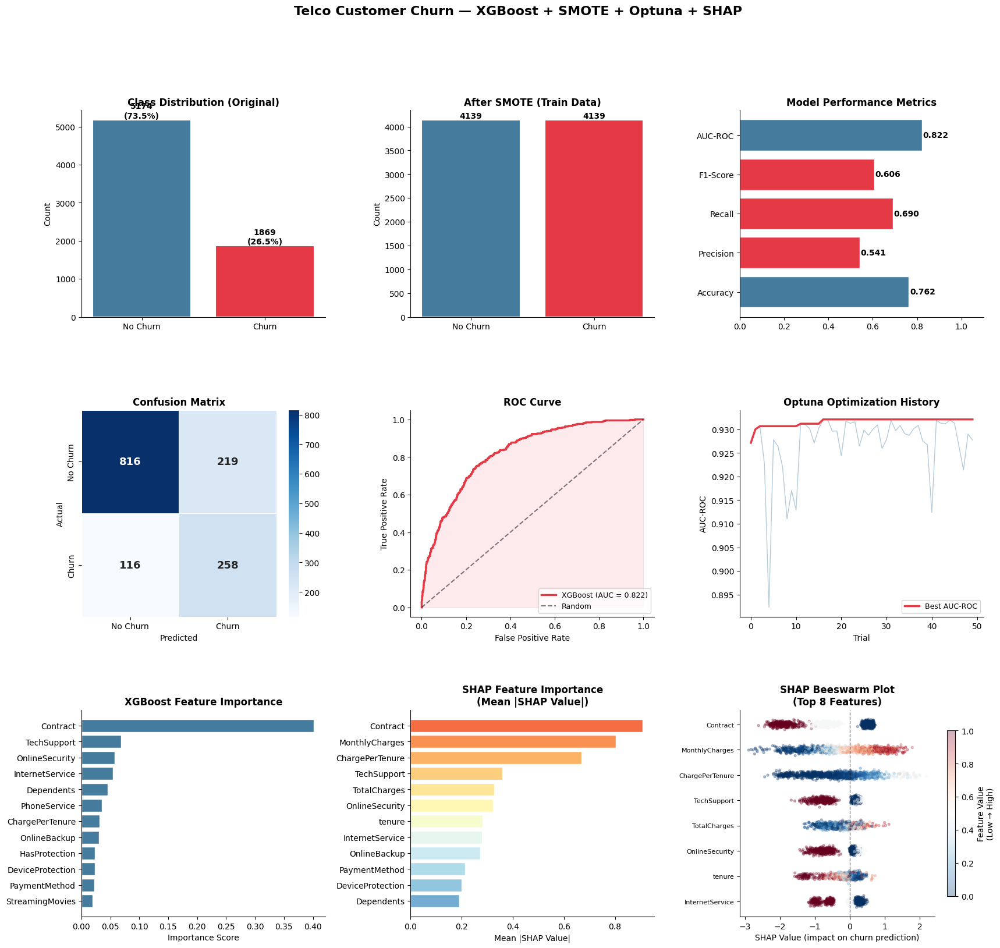

# Customer Churn Prediction using XGBoost + SMOTE + Optuna + SHAP

## 📌 Project Overview
Project ini merupakan studi kasus **Customer Churn Prediction** menggunakan dataset Telco Customer Churn dari Kaggle.  
Tujuan utama dari project ini adalah memprediksi apakah seorang pelanggan akan berhenti berlangganan (churn) berdasarkan data demografis dan layanan yang digunakan.

Metode yang digunakan dalam project ini:
- **SMOTE** untuk menangani class imbalance
- **XGBoost** sebagai model klasifikasi utama
- **Optuna** untuk hyperparameter tuning otomatis
- **SHAP** untuk interpretasi model (explainability)

---

## 📊 Dataset
Dataset yang digunakan:  
https://www.kaggle.com/datasets/blastchar/telco-customer-churn

- **Total data:** 7.043 baris, 21 kolom
- **Target:** `Churn` (Yes/No)
- **Distribusi kelas (original):**
  - No Churn: 5.174 (73.5%)
  - Churn: 1.869 (26.5%)

Fitur utama yang tersedia:
- Demografis: `gender`, `SeniorCitizen`, `Partner`, `Dependents`
- Layanan: `PhoneService`, `InternetService`, `StreamingTV`, `StreamingMovies`, dll.
- Billing: `MonthlyCharges`, `TotalCharges`, `Contract`, `PaymentMethod`

---

## ⚙️ Workflow

### 1. Data Loading & Understanding
- Dataset dimuat dari file CSV hasil download Kaggle API
- Mengecek missing values — **tidak ditemukan missing value** pada semua kolom
- Total: **7.043 rows × 21 columns**

### 2. Preprocessing
- Drop kolom `customerID` (tidak relevan)
- Konversi `TotalCharges` ke numerik, isi missing dengan median
- Encoding target `Churn`: Yes → 1, No → 0
- Label Encoding pada **15 kolom kategorikal**

### 3. Feature Engineering
Penambahan 4 fitur baru:
| Fitur Baru | Deskripsi |
|---|---|
| `ChargePerTenure` | Biaya per bulan relatif terhadap lama berlangganan |
| `TotalServices` | Jumlah total layanan yang digunakan |
| `HasStreaming` | Apakah customer menggunakan streaming (TV/Movies) |
| `HasProtection` | Apakah customer menggunakan layanan proteksi (Security/Backup/Device) |

### 4. Train-Test Split & SMOTE
- Split: **80% train / 20% test** (stratified)
- Train set: 5.634 samples | Test set: 1.409 samples
- **Sebelum SMOTE:** {No Churn: 4.139, Churn: 1.495}
- **Setelah SMOTE:** {No Churn: 4.139, Churn: 4.139} ✅ balanced

### 5. Hyperparameter Tuning (Optuna)
- Metode: Bayesian Optimization dengan **50 trials**
- Scoring: AUC-ROC (5-Fold Stratified CV)
- **Best CV AUC-ROC: 0.9321**
- Best parameters yang ditemukan:

| Parameter | Value |
|---|---|
| n_estimators | 487 |
| max_depth | 7 |
| learning_rate | 0.0355 |
| subsample | 0.7746 |
| colsample_bytree | 0.7339 |
| min_child_weight | 2 |
| gamma | 0.8069 |
| scale_pos_weight | 1.7925 |

### 6. Training & Evaluasi

---

## 📈 Results

### Model Performance (Test Set)

| Metric | Score |
|--------|-------|
| **Accuracy** | 0.7622 (76.22%) |
| **Precision** | 0.5409 |
| **Recall** | 0.6898 |
| **F1-Score** | 0.6063 |
| **AUC-ROC** | **0.8216** |

### Classification Report

| Class | Precision | Recall | F1-Score | Support |
|-------|-----------|--------|----------|---------|
| No Churn | 0.88 | 0.79 | 0.83 | 1.035 |
| Churn | 0.54 | 0.69 | 0.61 | 374 |
| **Accuracy** | | | **0.76** | 1.409 |

---

## 📊 Visualization

Visualisasi terdiri dari **9 panel** yang dibagi ke dalam 3 baris:

### Baris 1 — Data Overview & Performance
| Panel | Penjelasan |
|---|---|
| **Class Distribution (Original)** | Dataset asli sangat imbalanced: 5.174 (73.5%) No Churn vs 1.869 (26.5%) Churn. Kondisi ini berpotensi membuat model bias ke kelas mayoritas. |
| **After SMOTE (Train Data)** | Setelah SMOTE diterapkan pada train set, distribusi menjadi seimbang: masing-masing 4.139 sample per kelas. SMOTE mensintesis data baru pada kelas minoritas secara sintetis. |
| **Model Performance Metrics** | Ringkasan semua metrik evaluasi. AUC-ROC (0.822) berwarna biru karena ≥ 0.75, sedangkan Precision (0.541), Recall (0.690), F1-Score (0.606), dan Accuracy (0.762) berwarna merah karena masih di bawah threshold tersebut. |

### Baris 2 — Model Evaluation
| Panel | Penjelasan |
|---|---|
| **Confusion Matrix** | Dari 1.409 test samples: model benar memprediksi 816 No Churn (True Negative) dan 258 Churn (True Positive). Namun terdapat 219 false alarm (FP) dan 116 churn yang tidak terdeteksi (FN). Recall churn 69% menunjukkan model cukup baik menangkap pelanggan yang benar-benar churn. |
| **ROC Curve** | Kurva ROC model (AUC = 0.822) jauh di atas garis diagonal random classifier, menunjukkan model memiliki kemampuan diskriminasi yang baik antara churn dan tidak churn. |
| **Optuna Optimization History** | Grafik menunjukkan proses konvergensi Optuna selama 50 trials. Best AUC-ROC cross-validation mencapai **0.9321** dan sudah stabil sejak awal trial (sekitar trial ke-5), menandakan proses tuning efisien. |

### Baris 3 — Feature Importance & SHAP
| Panel | Penjelasan |
|---|---|
| **XGBoost Feature Importance** | Berdasarkan gain score internal XGBoost, `Contract` mendominasi dengan skor ~0.40, jauh di atas fitur lain. Diikuti `TechSupport`, `OnlineSecurity`, `InternetService`, dan `Dependents`. |
| **SHAP Feature Importance (Mean \|SHAP Value\|)** | SHAP memberikan interpretasi yang lebih akurat secara global. `Contract` tetap teratas, diikuti `MonthlyCharges`, `ChargePerTenure` (fitur rekayasa), `TechSupport`, `TotalCharges`, dan `OnlineSecurity`. |
| **SHAP Beeswarm Plot** | Setiap titik adalah satu data sampel. Warna merah = nilai fitur tinggi, biru = rendah. Terlihat bahwa `Contract` bernilai tinggi (merah) mendorong prediksi **tidak churn** (SHAP positif ke kanan), sedangkan nilai rendah (biru/kontrak bulanan) mendorong ke arah **churn** (kiri). Pola serupa terlihat pada `TechSupport` dan `OnlineSecurity`. |

---

## 🔍 SHAP Analysis — Top Faktor Penyebab Churn

| Rank | Feature | Mean \|SHAP\| | Interpretasi |
|------|---------|--------------|--------------|
| 1 | `Contract` | ~1.0 (normalized) | Kontrak panjang → tidak churn; kontrak bulanan → churn |
| 2 | `MonthlyCharges` | ~0.85 | Tagihan tinggi meningkatkan risiko churn |
| 3 | `ChargePerTenure` | ~0.70 | Biaya tinggi di awal berlangganan = rentan churn |
| 4 | `TechSupport` | ~0.55 | Tidak ada tech support → mendorong churn |
| 5 | `TotalCharges` | ~0.50 | Akumulasi biaya berhubungan dengan durasi dan loyalitas |
| 6 | `OnlineSecurity` | ~0.45 | Tidak ada online security → churn lebih tinggi |
| 7 | `tenure` | ~0.40 | Tenure pendek = lebih mudah churn |
| 8 | `InternetService` | ~0.35 | Jenis layanan internet memengaruhi keputusan churn |

> **Key Insight dari Beeswarm:** Nilai `Contract` yang rendah (biru = kontrak bulanan/month-to-month) memiliki SHAP value negatif (mendorong ke prediksi churn), sementara nilai tinggi (merah = kontrak 1–2 tahun) mendorong ke prediksi tidak churn. Ini menjadi sinyal terkuat dan paling konsisten di seluruh dataset.

---

## 💡 Business Insights

### 🔹 Kontrak Bulanan = Risiko Tinggi
Pelanggan dengan kontrak month-to-month memiliki probabilitas churn paling tinggi. Perusahaan perlu memberikan insentif untuk mendorong upgrade ke kontrak tahunan.

**Strategi:** Diskon atau benefit eksklusif untuk pelanggan yang upgrade kontrak ke 1–2 tahun.

---

### 🔹 Monthly Charges Tinggi = Trigger Churn
Pelanggan dengan tagihan bulanan tinggi namun tidak merasa mendapat value yang sepadan lebih mudah berpindah.

**Strategi:** Bundling produk atau loyalty reward untuk pelanggan dengan tagihan tinggi.

---

### 🔹 Tech Support Berpengaruh Signifikan
Tidak tersedianya dukungan teknis menjadi salah satu faktor pendorong churn.

**Strategi:** Tingkatkan kualitas dan aksesibilitas layanan Tech Support, khususnya untuk pelanggan tanpa kontrak panjang.

---

### 🔹 Tenure Pendek = Rentan Churn
Pelanggan dengan tenure rendah (baru berlangganan) cenderung lebih mudah churn sebelum merasakan nilai jangka panjang layanan.

**Strategi:** Onboarding program yang kuat di bulan-bulan awal berlangganan.

---

## 📌 Conclusion

Model XGBoost yang dioptimasi dengan Optuna berhasil mencapai **AUC-ROC sebesar 0.8216** pada test set, menunjukkan kemampuan yang cukup baik dalam membedakan pelanggan yang churn dan tidak. SMOTE efektif menangani ketidakseimbangan kelas, dan SHAP memberikan transparansi terhadap faktor-faktor yang paling mempengaruhi prediksi. Faktor dominan churn adalah jenis kontrak, besaran tagihan bulanan, dan kualitas layanan teknis.
